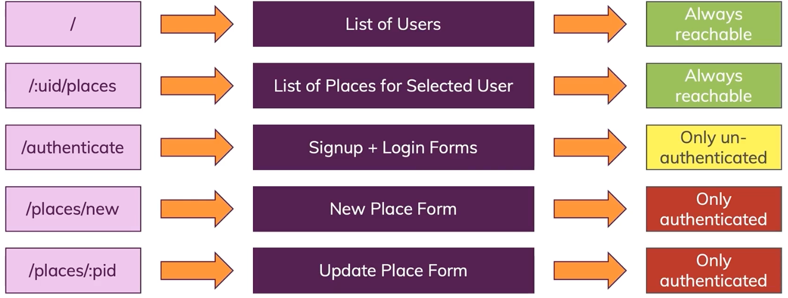

# Frontend

## SPA



## Routes

```jsx
function App() {

  return (
    <>
      <Routes>
        <Route index path='/' element={<Users/>}></Route>
        <Route path='/place/new' element={<NewPlace/>}></Route>
        <Route path='*' element={<Navigate to='/' replace/>}></Route>
      </Routes>
    </>
  )
}
```


- stateful component
- representational component


